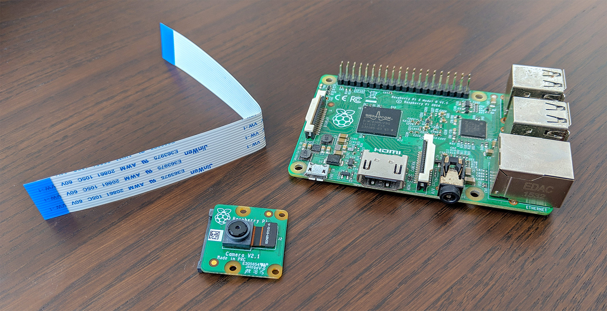

# Getting started

You'll want to have your [supported device and camera](/docs/device-support) ready to go before deploying the application. If y

Start by deploying balenaCam to a balenaCloud application using our one-click deploy method:

You need to start a [free balenaCloud account](https://dashboard.balena-cloud.com/signup) for the deploy method to work. Your first ten devices on balenaCloud are fully-featured, free of charge, and don't require a payment method to start.

## Deploy using balenaCLI

If you prefer to use our CLI method to deploy this project, follow these instructions.

- Sign up on [balena.io](https://balena.io/) and follow our [Getting Started Guide](https://balena.io/docs/learn/getting-started).
- Clone [this repository](https://github.com/balenalabs/balena-cam) to your local workspace.
- Unset (delete) the environment variable `BALENA_HOST_CONFIG_gpu_mem` or `RESIN_HOST_CONFIG_gpu_mem` if exists, from the `Fleet Configuration` application side tab.
- Set these variables in the `Fleet Configuration` application side tab
  - `BALENA_HOST_CONFIG_start_x` = `1`
  - Set all the following `gpu_mem` variables so your Pi can autoselect how much memory to allocate for hardware accelerated graphics, based on how much RAM it has available

    | Key                                  | Value
    |--------------------------------------|----------
    |**`BALENA_HOST_CONFIG_gpu_mem_256`**  | **`192`**
    |**`BALENA_HOST_CONFIG_gpu_mem_512`**  | **`256`**
    |**`BALENA_HOST_CONFIG_gpu_mem_1024`** | **`448`**
- Using [balenaCLI](https://www.balena.io/docs/reference/cli/), push the code with `balena push <application-name>`.
- See the magic happening, your device is getting updated 🌟Over-The-Air🌟!
- In order for your device to be accessible over the internet, toggle the switch called `PUBLIC DEVICE URL`.
- Once your device finishes updating, you can watch the live feed by visiting your device's public URL.

For a more detailed guide, check out our [balenaCam project blog post](https://www.balena.io/blog/build-a-raspberry-pi-based-network-camera/). You can also [visit the Forums](https://forums.balena.io/c/project-help/12) if you need help, want to help others, or want to show off your amazing project.

## Having troubles?

If you are running into issues getting your balenaCam application running, please try the following:
1. Check the [support and troubleshooting guide](https://github.com/balenalabs/balena-sound/blob/master/docs/support) for common issues and how to resolve them.
2. Post in the [balenaSound forum](https://forums.balena.io/c/balenalabs/balenasound/85) for help from our growing community.
3. Create an issue on the [balenaSound GitHub project](https://github.com/balenalabs/balena-sound/issues/new/choose) if you find your issue may be a problem with balenaSound.

## Become a balena poweruser

Want to learn more about what makes balena work? Try one of our [masterclasses](https://www.balena.io/docs/learn/more/masterclasses/overview/). Each lesson is a self-contained, deeply detailed walkthrough on core skills to be successful with your next edge project.

Check them out at our [docs](https://www.balena.io/docs/learn/more/masterclasses/overview/). Also, reach out to us on the [Forums](https://forums.balena.io/) if you need help.