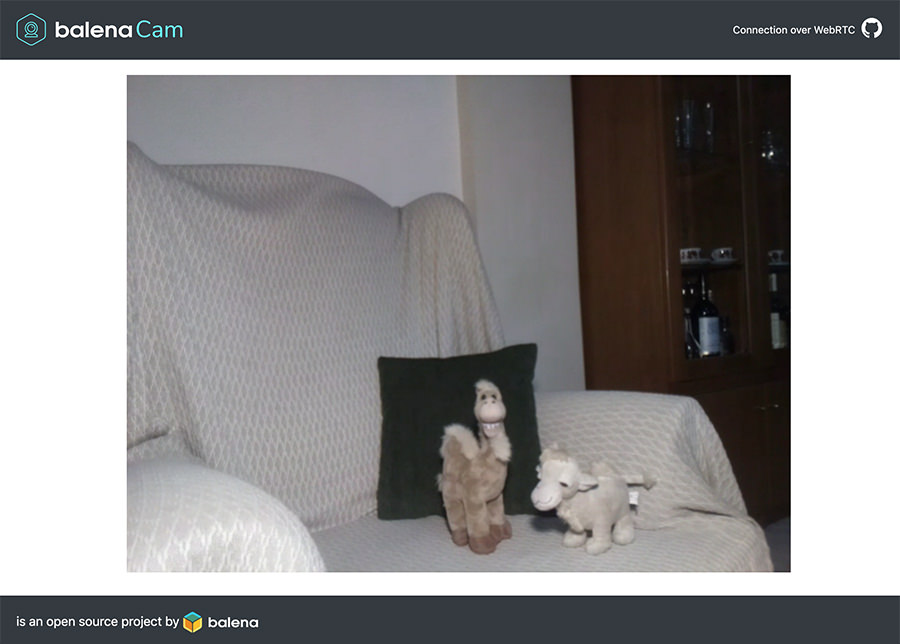
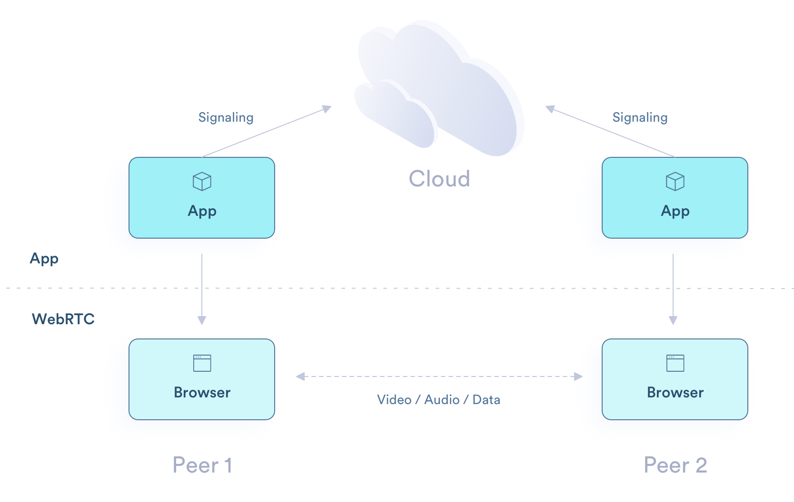

# Usage

## Accessing your device's stream locally

You can access the local IP address of your device by clicking on it within your balenaCloud dashboard, within the balenaCam application (or whatever you chose to name the application). In the left-side dashboard pane, you'll see its assigned local IP address. Open this address in a new tab to see your balenaCam application's stream.

## Accessing your device's public IP address

Every device in a balenaCloud application can generate a secure public URL. This allows other users to access the device's  capabilities or content, but not make any code changes. When you access this public URL, you'll only see the balenaCam feed as in the example above.

## About WebRTC
WebRTC is an awesome way to send video, audio or data, that’s why most of the big services we use to communicate choose it and the reason why it is going to be widely used in the years to come.

WebRTC describes a connection between two peers and tries to traverse the NATs involved from Peer1 to Peer2 (using the stun protocol), and vice versa. If data can be sent between the two peers, we have a direct connection. In the real world, these direct connections can fail in some cases. This is due to the topology and how restrictive the networks involved are. In these failed cases and in order to actually establish the connection, WebRTC introduces a type of server that acts as a data relay between the two peers, this is called a TURN server.

Even though there are some projects out there that can be used on a Raspberry Pi to stream video over WebRTC, they have their limitations. For example, they can’t stream video to more than one client at the same time, that’s why we decided to build balenaCam.